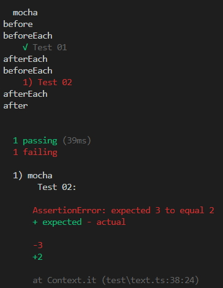
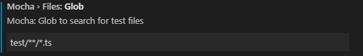
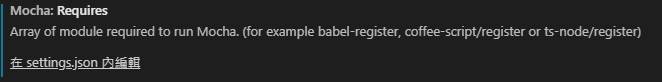
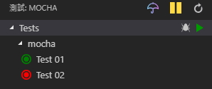
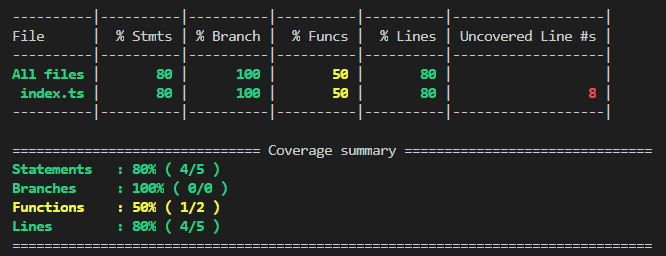
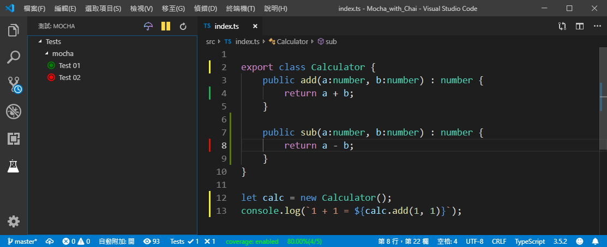

# 範例內容

## (1) 單元測試處理

* 會使用的套件
  * Mocha - Testing Framework
  * Chai - Assertion Library
  * Istanbul - Testing Coverage


---

## (2) 如何開始單元測試


### Step.1 安裝相關套件

* **安裝 Mocha**
  *  Testing Framework

```shell
npm install mocha --save-dev
npm install @types/mocha --save-dev
```

* **安裝 Chai**
  * Assertion Library

```shell
npm install chai --save-dev
npm install @types/chai --save-dev
```

* **安裝 ts-node、typescript**
  * **ts-node** : (編譯模組)
  * **typescript** : (TypeScript 編譯器)

```shell
npm install ts-node --save-dev
npm install typescript --save-dev
```


### Step.2 設定 NPM Test 指令

* 修改 **package.json** 檔案
  * 在 scripts.test 裡，加入 npm test 指令

```json
{
    "scripts": {
        "test": "mocha --require ts-node/register test/**/*.ts",
        "build": "tsc",
        "watch": "tsc -w",
        "nodewatch": "nodemon dist/index.js",
        "start": "node dist/index.js"
    }
}
```


### Step.3 撰寫單元測試測試案例

> 1. 詳細請看原始碼
> 2. [Chai 官方文件](https://www.chaijs.com/)


### Step.4 執行測試

* **(1) 編譯 TypeScript**

```shell
npm run build
```

或是

```shell
tsc
```


* **(2) 輸入以下指令執行測試**

```shell
npm run test
```




## (3) 如何在 Visual Studio Code 上執行單元測試


### Step.1 安裝 Visual Studio Code Plugin

* **安裝 [Mocha sidebar](https://marketplace.visualstudio.com/items?itemName=maty.vscode-mocha-sidebar)**


### Step.2 設定 Mocha sidebar

* **設定測試案例的檔案為 typescript**
  * `test/**/*.ts` (相對目錄)



* **設定引用的模組 `ts-node/register`**



* **Visual Studio Code Setting.json**

```json
{
    // Mocha Sidebar
    "mocha.files.glob": "test/**/*.ts",			// 相對目錄，可以照需求調整
    "mocha.requires": [ "ts-node/register" ]	// 設定引用的模組
}
```


### Step.3 使用 Mocha sidebar 執行/偵錯單元測試




## (4) 如何顯示測試覆蓋率 (Testing Coverage)

### Step.1 安裝相關套件

- **安裝 Istanbul **
  - Testing Coverage

```shell
npm install nyc --save-dev
```


### Step.2 設定測試覆蓋率報表

* 修改 **package.json** 檔案
  * 在 scripts.test 裡，加入 npm coverage 指令

```json
{
    "scripts": {
        "test": "mocha --require ts-node/register test/**/*.ts",
        "coverage": "nyc mocha --require ts-node/register test/**/*.ts",
        "build": "tsc",
        "watch": "tsc -w",
        "nodewatch": "nodemon dist/index.js",
        "start": "node dist/index.js"
    }
}
```

* 修改 **package.json** 檔案
  * 加入 nyc 執行參數設定
    * Reporter 類型請[參考這裡](https://istanbul.js.org/docs/advanced/alternative-reporters/)

```json
{
    "nyc": {
        "include": [
            "src/**/*.ts",
            "src/**/*.tsx"
        ],
        "extension": [
            ".ts",
            ".tsx"
        ],
        "require": [
            "ts-node/register"
        ],
        "reporter": [
            "text",
            "text-summary",
            "html"
        ],
        "sourceMap": true,
        "instrument": true
    }
}
```


### Step.3 產生測試覆蓋率

- **輸入以下指令產生測試覆蓋率**

```shell
npm run coverage
```





## (5) 如何在 Visual Studio Code 上顯示測試覆蓋率 (Testing Coverage)

### Step 0 請完成前兩大點的操作

### Step 1. 使用使用 Mocha sidebar 執行單元測試

* 測試案例會以顏色顯示覆蓋的程式碼區況
* 下方狀態列會顯示測試覆蓋率與單元測試結果

